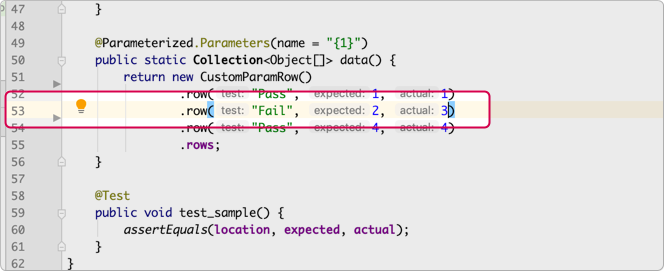

## Console File Caddy

A JetBrains IDE plugin plugin to convert console output text to links for absolute paths,
`file://` or `fqn://` URI with optional `#line:column` anchor refs to specify the line and
column location in the editor.

* Absolute paths in the form: `/...../some-file.ext:xxx` on OS X/Unix systems and
  `x:\....\some-file.ext:xxx` or `x:/..../some-file.ext:xxx` on Windows systems will be
  converted to links, where `xxx` is line/column information.

* The plugin is liberal in recognizing the suffix with `yyy` being line number and `xxx` column
  and will accept `#Lyyy`, `:yyy:xxx`, `(yyy:xxx)`, `[yyy-xxx]` and their permutations.

* `fqn://` protocol followed by a language specific fully qualified class name and optional line
  and column information. This link only requires a fully qualified class name which is
  independent of the physical location of the project.

* `diff:///path1#xxx?/path2#yyy&` protocol followed by two absolute paths, with line information
  appended to the path. If the paths are both files then a file diff viewer will be opened, if
  not possible then both files will be opened in editors. If both file paths are directories,
  then directory diff viewer will be opened.

Great for navigating to file references in console application which outputs absolute file path
with line information.

`diff://` links are good in utilities or tests for which the IDE does not know how to interpret
its output to create a difference view link.

`fqn://` links are great for generating links in test output, including parameterized tests,
with `assertXXX(message, expected, actual)` assertions. Add an `fqn://` reference for the
file/line/column of the source of the test parameter data and get a failed test with a navigable
link to the data.

Parametrized tests are a PITA to maintain because finding the location of the data for a failed
test is an exercise in frustration. The IDE test console provides a convenient link to the
source of the failed test but not the location of the parameterized data used for the test.

Use something like
[SampleCustomTest.java](src/test/java/com/vladsch/plugins/consolefilecaddy/SampleCustomizedTest.java) in
parameterized tests to generate a link in the message for failed tests. The link will take you
right to the data location, no long search or guesswork.

A simpler one line version, without the hassles of computing column information will navigate to
the start of line for the parameterized data definition
[SampleTest.java](src/test/java/com/vladsch/plugins/consolefilecaddy/SampleTest.java).

Running these tests for this project in IntelliJ will result in a failed test output with a
navigable link to the errant test parameter row:

Navigation takes you right to the location of the data:

